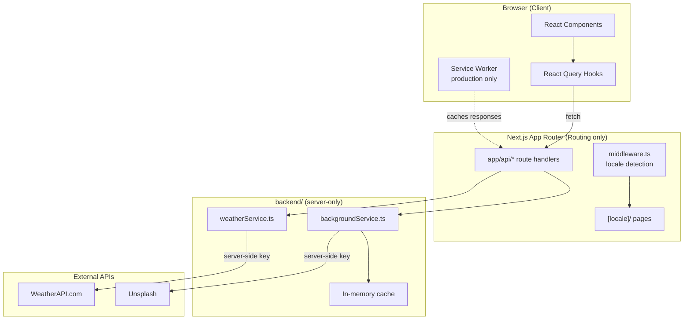

# 🌤️ Atmos Weather Dashboard

[](https://nextjs.org/)
[](https://www.typescriptlang.org/)
[](https://tanstack.com/query)
[](https://tailwindcss.com/)

A Next.js 14 (App Router) weather dashboard built for a **bilingual,
offline-tolerant experience**: English/Arabic with full RTL support, dynamic
mood-matching backgrounds, and a service worker that keeps the last forecast
usable when the network isn't.

---

## What makes this more than a weather-API wrapper

A basic weather app is "fetch data, show it." This one solves three
problems a basic wrapper doesn't:

1. **Bilingual RTL from the ground up** — not a translated afterthought.
   Routing, layout direction, and locale detection are handled at the
   middleware level via `next-intl`, so `/ar/*` and `/en/*` are fully
   separate, correctly-directioned experiences.
2. **Graceful offline degradation** — a production-only service worker
   (`public/sw.js`) caches `/api/weather` and `/api/locations` responses, so
   a spotty connection shows the last known forecast instead of a blank
   error screen.
3. **Server-only secrets in a framework that blurs client/server** — Next.js
   makes it easy to accidentally leak an API key into client bundles. Here,
   every external call is routed through `app/api/*` route handlers that
   delegate to `backend/services/*`, so `WEATHER_API_KEY` and
   `UNSPLASH_ACCESS_KEY` never ship to the browser.

---

## Architecture



**Key design decisions:**

- **`app/` stays a thin routing layer** — Next.js requires it at the
  project root for file-based routing, but all real logic lives in
  `backend/` (server-only) and `frontend/` (client-only), organized by
  concern rather than by framework convention.
- **`shared/weatherTheme.ts`** derives the background gradient/theme from
  the current weather condition, used by both the backend (for
  Unsplash query terms) and the frontend (for the gradient itself) — a
  single source of truth instead of duplicating the mapping.
- **Service worker only in production** (`NODE_ENV=production` gate) so it
  never interferes with local development hot-reloading.
- **`localStorage` favorites** — no backend database needed for this
  feature; favorites are a client-side convenience, not account-bound
  data.

---

## Features

- 🌍 **English + Arabic**, full RTL layout support via `next-intl`
- ⚡ **React Query caching** — avoids redundant API calls, background
  refetching, stale-while-revalidate behavior
- 🖼️ **Dynamic backgrounds** — Unsplash images matched to current weather
  condition via `shared/weatherTheme.ts`
- 📶 **Offline support** — service worker caches the last successful
  forecast and location lookups
- ⭐ **Favorites** — save frequently checked locations via `localStorage`
- ⌨️ **Keyboard shortcuts** — faster navigation for power users
- 📍 **Geolocation** — auto-detect the user's current location on load

---

## Tech Stack

| Layer | Stack |
|---|---|
| Framework | Next.js 14 (App Router) |
| Language | TypeScript |
| Data fetching | React Query (TanStack Query) |
| Styling | Tailwind CSS |
| i18n | next-intl (English/Arabic, RTL) |
| Weather data | WeatherAPI.com |
| Backgrounds | Unsplash API |
| Offline | Service Worker (production only) |

---

## Project Structure

```
app/                 # Routing only (Next.js requirement) — pages, layouts, API routes
  [locale]/           # Localized pages (en/ar), redirected to by middleware.ts
  api/                 # Route handlers — thin wrappers around backend/services

backend/             # Server-only code, never bundled into client JS
  env.ts                # Env var validation
  services/
    weatherService.ts     # WeatherAPI.com integration
    backgroundService.ts  # Unsplash integration + in-memory cache

frontend/            # Client-side code
  components/           # UI components
  hooks/                 # React Query hooks, geolocation, keyboard shortcuts
  providers/             # React Query provider, error boundary
  lib/                   # Client-side fetch wrapper, localStorage favorites

shared/              # Used by both backend and frontend
  weatherTheme.ts        # Weather-condition -> theme/gradient derivation

i18n/, messages/      # next-intl routing config and translation files
middleware.ts          # Locale detection/redirect (excludes /api)
public/sw.js            # Service worker (production-only, caches /api/weather + /api/locations)
```

---

## Getting Started

1. Install **Node.js 18.17+**.
2. In the project root, run:

   ```bash
   npm install
   ```

3. Copy the environment template and fill in your keys:

   ```bash
   cp .env.local.example .env.local
   ```

   | Variable | Required | Description |
   |---|---|---|
   | `WEATHER_API_KEY` | ✅ | WeatherAPI.com key |
   | `UNSPLASH_ACCESS_KEY` | Optional | Unsplash key for dynamic backgrounds |

4. Run the dev server:

   ```bash
   npm run dev
   ```

   Visit `http://localhost:3000`.

Both API keys are **server-only** — never exposed to the browser. All
external calls go through Next.js route handlers in `app/api/*`, which
delegate to `backend/services/*`.

---

## Deploying

This is a standard Next.js app — [Vercel](https://vercel.com) is the path
of least resistance (zero config, matches the `next build`/`next start`
scripts already in `package.json`). Any Node.js host that runs
`npm run build && npm run start` also works.

**Before deploying:**

- Set `WEATHER_API_KEY` (required) and `UNSPLASH_ACCESS_KEY` (optional) as
  environment variables on your host — same names as `.env.local`. Never
  commit `.env.local` itself (already gitignored).
- `next.config.js` already whitelists `images.unsplash.com` for
  `next/image`; if you change the background image source, update
  `images.remotePatterns` there too.
- The service worker (`public/sw.js`) only registers when
  `NODE_ENV=production`, so it won't interfere with local dev.

---

## Roadmap

- [x] Weather lookup by location / geolocation
- [x] Bilingual UI with RTL support
- [x] Dynamic weather-matched backgrounds
- [x] Offline caching via service worker
- [x] Favorites (localStorage)
- [ ] Automated tests (component + integration)
- [ ] CI pipeline (lint + test on every push)
- [ ] Production deployment
- [ ] Push notifications for severe weather alerts

---

## Contributing

This is currently a personal/portfolio project, but suggestions and bug
reports are welcome via [Issues](../../issues). If you'd like to contribute
code, please open an issue first to discuss the change.

---

## License

No license file yet — all rights reserved by default. Add an
[MIT](https://choosealicense.com/licenses/mit/) or similar license if you'd
like others to freely use or build on this code.
